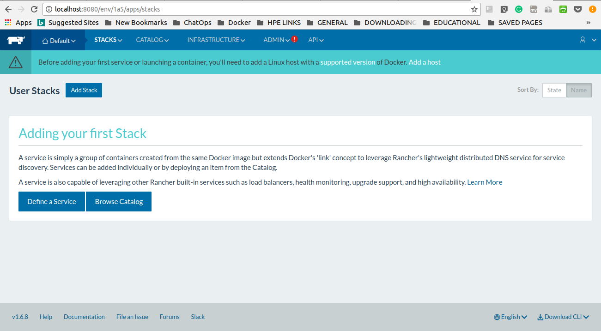
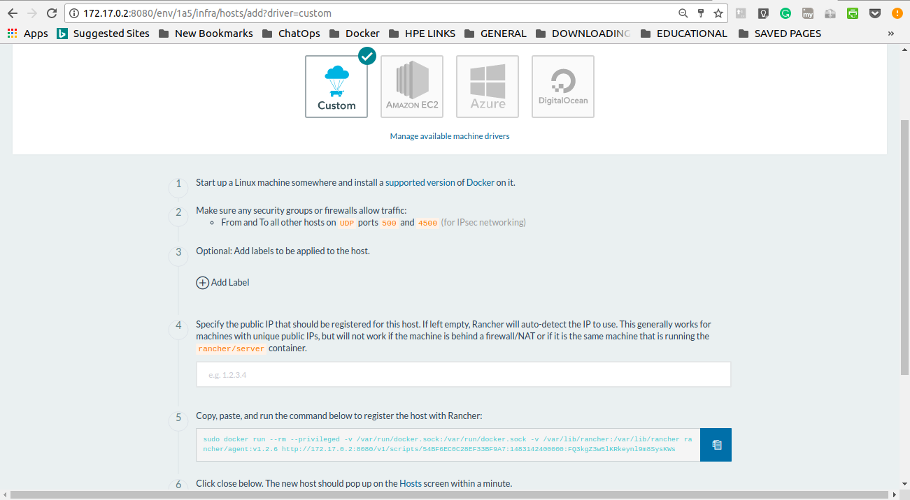
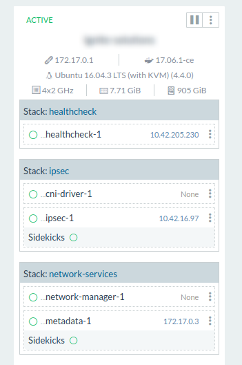
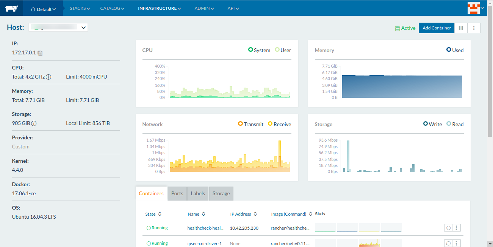
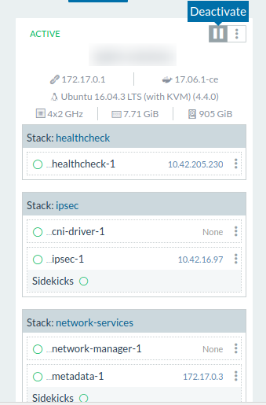

`Rancher` is an open source software platform that enables organizations to run and manage *Docker* and *Kubernetes/Swarm/Mesos* in production. With Rancher, organizations no longer have to build a container services platform from scratch using a distinct set of open source technologies. Rancher supplies the entire software stack needed to manage containers in production.

Rancher software consists of **four** major components:

  * Infrastructure Orchestration
  * Container Orchestration & Scheduling
  * Application Catalog
  * Enterprise-Grade Control


In this tutorial, you'll get to know about Rancher Server Installation, Adding Custom Hosts to the Rancher Server, Creating Environments & much more!

### Pre-requisites

1. A Linux machine of any configuration with an access to Interne. t.
2. Docker Installed on the same machine. (If you don't know how to, visit <a href="https://docs.docker.com/engine/installation/linux/docker-ce/ubuntu/">HERE</a> and install it.

### Step 1 - Installing Rancher Server

* Verify your Docker Installation by

```shell
    abc@xyz:~$docker --version
    Docker version 17.06.1-ce, build 874a737
```

* Now, Install Rancher Server by running its docker container by

````shell
    abc@xyz:~$docker run -d --restart=unless-stopped -p 8080:8080 rancher/server 
````

Wherse,

   * `d`: Running the container in Detached mode
 * `--restart`=unless-stopped: Always restart the container regardless of the exit status
  * `-p 8080:8080` - Expose port 8080 of the container to the port 8080 on the host
   * `rancher/server`: Name of the Rancher Server Image
   * It will first pull the `*rancher/server*` image & then spin up the container on it.

* Verify that the container is running by:

````bash
    abc@xyz:~$docker ps

    CONTAINER ID     IMAGE          STATUS            PORTS
    01c0d330c84d  rancher/server  Up 10 Mins  0.0.0.0:8080->8080/tcp
````


### Step 2 - Accessing Web UI of Rancher Server

The UI and API will be available on the exposed port `8080`

Navigate to the following URL: `http://<SERVER_IP>:8080`
The `<SERVER_IP>` is the public IP address of the host that is running Rancher server. (In our case it will be localhost initially but later we will change it with an actual IP)




### Step 3 - Setting Access Control 

You will see a warning icon next to the **ADMIN** menu item at the top of the screen. If you hover over this link, you'll see the message **Access Control is not configured.**


**Access Control** is how Rancher limits the users who have the access permissions to your Rancher instance. By default, Access Control is **not configured**. This means anyone who has the IP address of your Rancher instance will be able to use it and access the API. Your Rancher instance is **open to the public!**

There are many ways to set Access Control, for now, we will use a Local account.

 * Go to the ***Admin > Access Control***
 * Select ***Local***
 * Enter ***Username & Password***
 * Click on ***Enable Access Control***


That's it! Local Authentication will now be enabled with your newly created User.

### Step 4 - Adding new Host

For this post, we will be creating a host on the same machine where Rancher Server resides. Practically, you will rarely have such situation.


 * Go to ***Infrastructure > Hosts***
 * Click on ***Add Host***
 * Click on ***Something else*** to enter an IP address to use for UI. Now, for this demo, we are setting the Rancher Server & Hosts on the same machine.
    So I will use ***Docker Container IP*** for Rancher Server so that we can add a host on the same machine.
 * To get an IP, type:

        ```bash
        abc@xyz:~$docker exec -it CONTAINER_NAME /bin/bash
        root@YOUR_CONTAINER_ID:/# ifconfig
        ```
    * Copy the `eth0:inet addr`
    * Click on Something else and put that ***IP:8080*** in the text box.
    * Click on ***Save***. 


* Now just enter the address `http://<SERVER_IP>:8080`
This time you will get a Login screen instead of a direct access. Login with your details.  


    
* Again go back to ***Infrastructure > Hosts***
* Click on ***Add Host***
* There are various ways to which you can add new hosts, for this demo we will add a custom host running on the same machine.
* Select ***Custom***
* Copy the generated code from ***Step 5***.   



* Paste the code into your terminal and hit Enter.

```bash
        abc@xyz:~$sudo docker run --rm --privileged -v /var/run/docker.sock:/var/run/docker.sock -v /var/lib/rancher:/var/lib/rancher rancher/agent:v1.2.6 http://172.17.0.2:8080/v1/scripts/54BF6EC0C28EF33BF9A7:1483142400000:FQ3kgZ3w5lKRkeynl9m8SysKWs
```

* If everything goes well, you will get an output like:

```bash
        INFO: Running Agent Registration Process, CATTLE_URL=http://172.17.0.2:8080/v1
        INFO: Attempting to connect to: http://172.17.0.2:8080/v1
        INFO: http://172.17.0.2:8080/v1 is accessible
        INFO: Inspecting host capabilities
        INFO: Boot2Docker: false
        INFO: Host writable: true
        INFO: Token: xxxxxxxx
        INFO: Running registration
        INFO: Printing Environment
        INFO: ENV: CATTLE_ACCESS_KEY=A9C001B621AD7B5D3443
        INFO: ENV: CATTLE_HOME=/var/lib/cattle
        INFO: ENV: CATTLE_REGISTRATION_ACCESS_KEY=registrationToken
        INFO: ENV: CATTLE_REGISTRATION_SECRET_KEY=xxxxxxx
        INFO: ENV: CATTLE_SECRET_KEY=xxxxxxx
        INFO: ENV: CATTLE_URL=http://172.17.0.2:8080/v1
        INFO: ENV: DETECTED_CATTLE_AGENT_IP=172.17.0.3
        INFO: ENV: RANCHER_AGENT_IMAGE=rancher/agent:v1.2.6
        INFO: Launched Rancher Agent: 8f5ce937fff4c179f26e64aea0887f40839f2d201581f66bf76009ae84c71477
```
* Within a few minutes, you'll see your new host in the Rancher UI. You will also get some basic information about the host such as its IP address, processor clock-speed, memory, and storage.



### Step 5 - Monitoring your Hosts

Once your host is added and is **Active**, you can click on the name of the host to open up the **Monitoring** window.



Here, you can view CPU utilization, memory consumption, Storage, Network details of that host. Also, you can see the containers that are running on that particular host.

If you see that you are using most of the memory or if your CPU is running continuously hot, you may want to launch more nodes to reduce container density and spread out the load. You can react quickly to load spikes by provisioning more compute nodes right from Rancher's UI.

Once the spikes abate, you can shut down any additional nodes by visiting the **Hosts** page, locating your host, and clicking the **Deactivate** icon (the box with two vertical lines, as shown in the following figure:



### Step 6 - Adding Services from Catalog

Being the leader, Rancher provides tons of Service integrations that you can use to install them on your hosts. To access them, go to ***Catalog > All***

Here, you can see the list of services currently available for you to use. You can click on ***View Details*** to check them out & modify the options for Installation.


### Conclusion

This article was meant for the basic introduction of Rancher. You now know how to launch, monitor, and deactivate compute nodes using Rancher. You can explore it further on your own by getting your hands dirty!

You're more than welcome to share this blog post with your friends/colleagues if you think they might benefit from it!