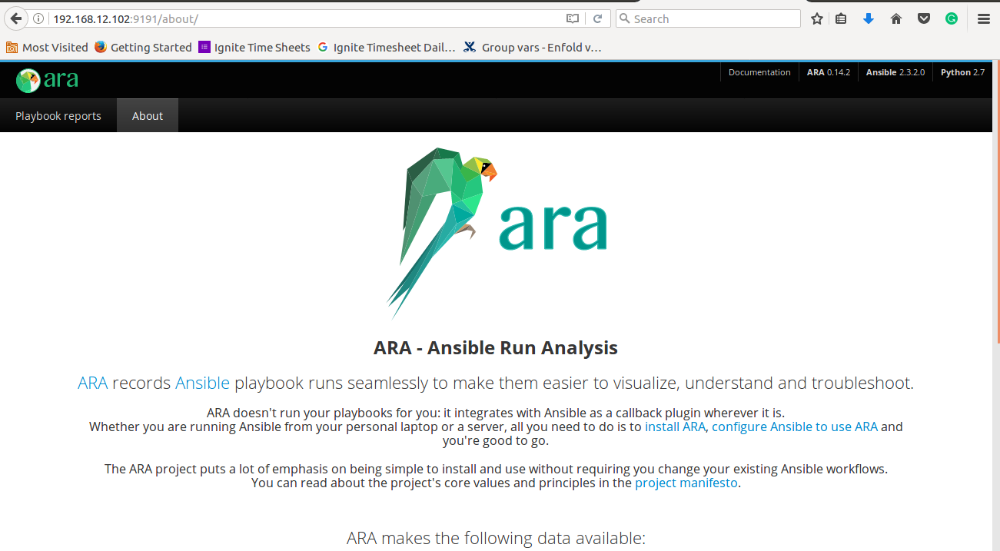
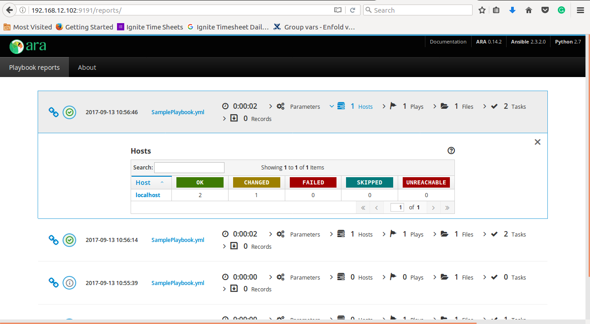
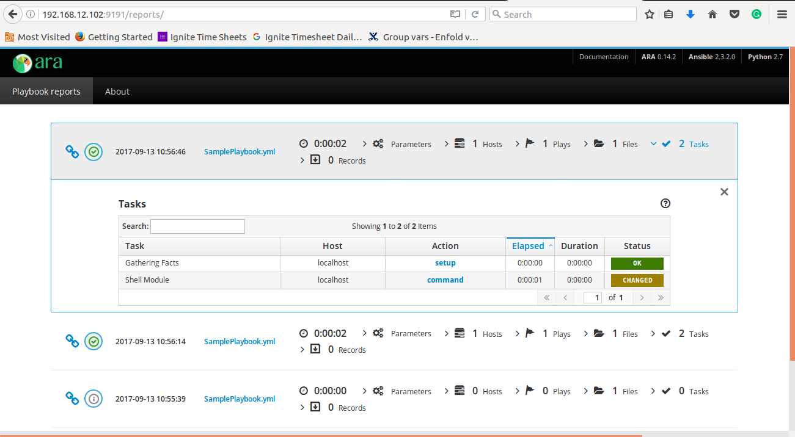
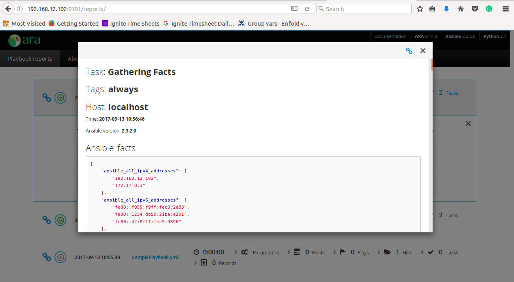

<a href="https://www.ansible.com/">Ansible</a> can be used for a lot of things and it’s grown pretty popular for managing servers and their configuration. Today, Ansible is heavily used to deploy or test through Continuous Integration (CI).

In the world of automated continuous integration, it’s not uncommon to have hundreds, if not thousands of jobs running every day for testing, building, compiling, deploying and so on.

### Problem

Well, you cannot call it as a "Problem!",  but Ansible runs generate quite a large amount of console data. And yes, it continues to grow with each ***flag*** (*Remember **-v** & **-vvv?***) that you add to the run! 

Keeping up with such a large amount of Ansible runs and their outcome, not just in the context of CI, is challenging.

Due to this mess, one tends to feel the need of something, that will present this verbose output in a way which is easily readable, graphical, tabular & more representative of the job status and debug information.

> That `something` is ARA.

### Ansible Run Analysis (ARA) Tool

*ARA* records *Ansible* playbook runs and makes the recorded data available and intuitive for users and systems. ARA organizes recorded playbook data in a way to make it intuitive for you to search and find what you’re interested in as fast and as easily as possible.



It provides summaries of task results per host or per playbook.


It allows you to filter task results by playbook, play, host, task or by the status of the task.



With ARA, you’re able to easily drill down from the summary view for the results you’re interested in, whether it’s a particular host or a specific task.



Beyond browsing a single ansible-playbook run, ARA supports recording and viewing multiple runs in the same database.



### Installation

There are 2 ways in which you can install ARA in your system.

1. Using **Ansible Role** hosted on my <a href="https://github.com/AjinkyaBapat/Ansible-Run-Analyser">GitHub Account </a>

    * Clone the repo & do:
          ```yaml
          ansible-playbook Playbook.yml
          ```
    * If Playbook run is successful, you will get:

```yaml
  TASK [ara : Display ara UI URL] ************************
  ok: [localhost] => {
    "msg": "Access playbook records at http://YOUR_IP:9191"
    }  
```
  * **Note**: It picks the IP address from ***ansible_default_ipv4*** fact gathered by *Ansible*. If there is no such fact gathered, replace it with your IP in `main.yml` file present in `roles/ara/tasks/` folder.

2. ARA is an open source project available on <a href="https://github.com/dmsimard/ara">Github</a> under the Apache v2 license. Installation instructions are present under **Quickstart chapter**.

The <a href="http://ara.readthedocs.io/en/latest/">Documentation</a> and <a href="http://ara.readthedocs.io/en/latest/faq.html">frequently asked questions</a> are available on `readthedocs.io`.

-----
### Conclusion

Ever since I came across this tool, it's been a useful resource for me to get more out of `Ansible` run logs and outputs. I would highly recommend it for all `Ansible Ninjas!` out there.

Feel free to share this with others and do let me know your experience of using ARA.